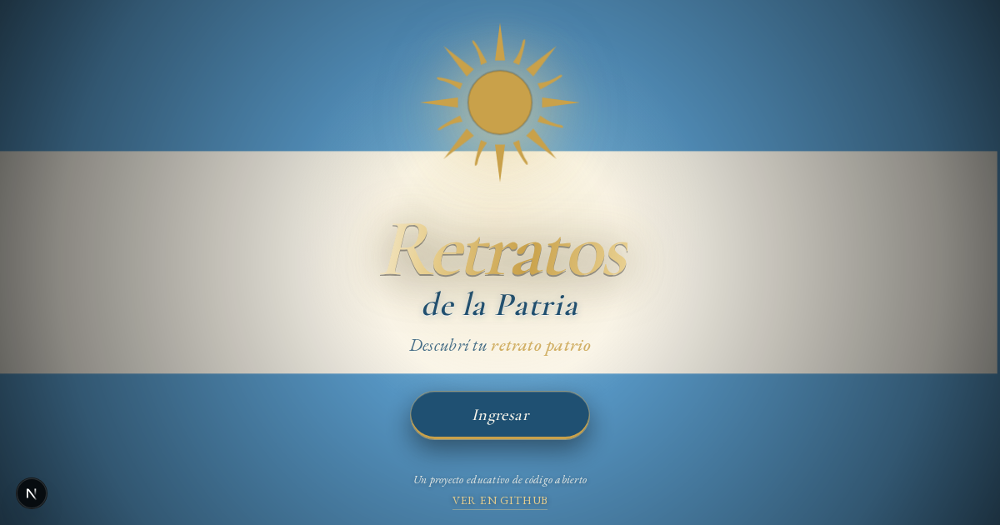
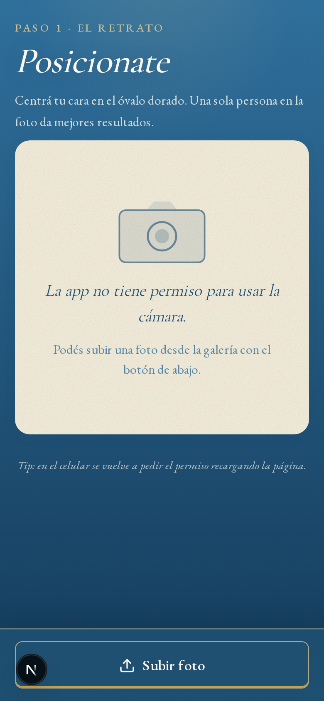
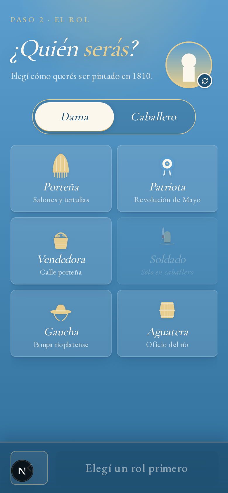
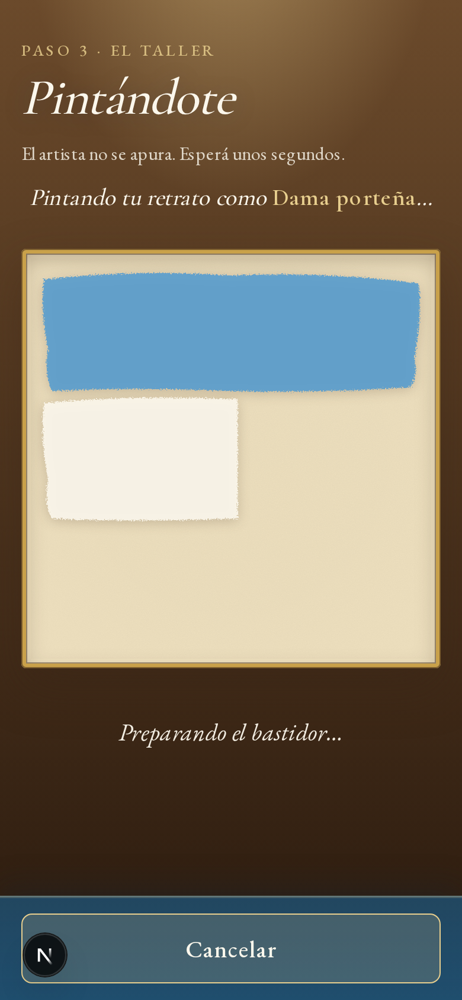
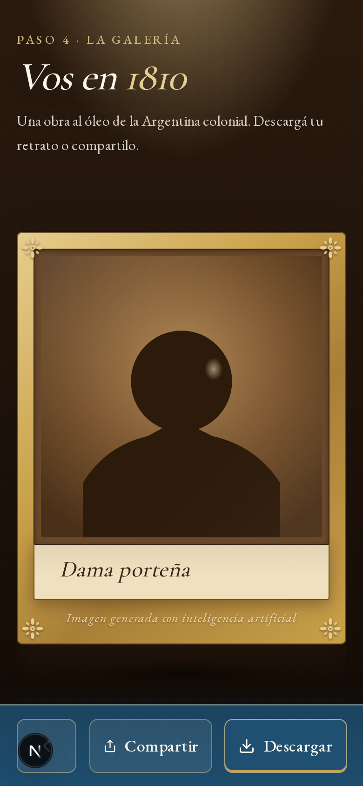
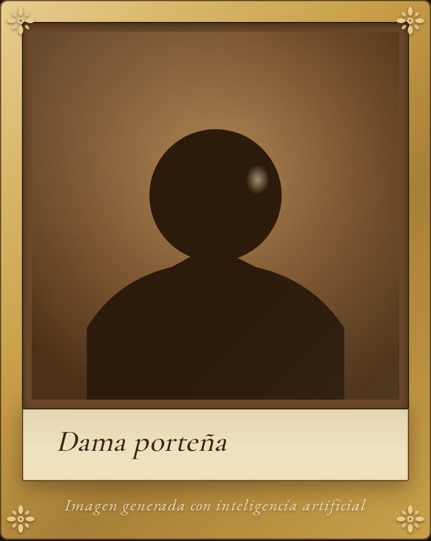

<div align="center">



# Retratos de la Patria

**Sacate una foto y mirate como una figura de la Argentina colonial de 1810.**
Tu mismo rostro, pintado al óleo y vestido de época. Pensada para la
Semana de Mayo en escuelas.

[](./LICENSE)
[](https://nextjs.org)
[](https://www.typescriptlang.org)
[](https://vercel.com)

</div>

---

## ¿Qué hace?

En 4 pasos: sacás una foto, elegís un personaje histórico, una IA te pinta
como esa figura al óleo, y descargás o compartís el cuadro.

<table>
  <tr>
    <td align="center">
      <br />
      <b>1. Sacate una foto</b><br />
      <sub>Cámara en vivo con guía facial.</sub>
    </td>
    <td align="center">
      <br />
      <b>2. Elegí un rol</b><br />
      <sub>6 personajes de 1810 curados.</sub>
    </td>
  </tr>
  <tr>
    <td align="center">
      <br />
      <b>3. La IA te pinta</b><br />
      <sub>Bandera dibujándose en celeste y blanco mientras esperás.</sub>
    </td>
    <td align="center">
      <br />
      <b>4. La galería</b><br />
      <sub>Tu retrato enmarcado, listo para descargar o compartir.</sub>
    </td>
  </tr>
</table>

El archivo que descargás es el **cuadro completo** — marco dorado, cartela
con el nombre del personaje, bandera argentina al pie y el Sol de Mayo:

<div align="center">
  
</div>

---

## Correrlo en tu compu (paso a paso, para cualquier nivel)

### Lo que necesitás antes de empezar

- **Node.js 20 o más nuevo** — si no lo tenés, descargalo desde [nodejs.org](https://nodejs.org).
  Para verificar tu versión:
  ```bash
  node -v   # tiene que decir v20.x o superior
  ```
- **Una cuenta de Google** — para sacar una API key de Gemini (gratis para probar, pago para uso en producción).
- **Un editor de código** — VS Code, Cursor, lo que uses.
- **Un terminal** — el de tu sistema operativo (Mac: Terminal, Windows: PowerShell, Linux: tu shell).

> 🐣 **Primera vez con esto:** los pasos están pensados para que copies
> y pegues. Si algo falla, mirá la sección
> [Si algo sale mal](#si-algo-sale-mal) al final.

### 1. Descargá el código

Con git (recomendado):
```bash
git clone https://github.com/maxiyommi/retratos-patria.git
cd retratos-patria
```

Sin git (alternativa):
1. Ir a [github.com/maxiyommi/retratos-patria](https://github.com/maxiyommi/retratos-patria)
2. Tocar el botón verde **Code** → **Download ZIP**
3. Descomprimir y entrar a la carpeta desde el terminal:
   ```bash
   cd retratos-patria-main
   ```

### 2. Instalá las dependencias

```bash
npm install
```

Tarda 1-2 minutos la primera vez. Va a descargar todas las librerías que
usa el proyecto en una carpeta `node_modules/`. Si te tira algún warning
de auditoría podés ignorarlo — son avisos no críticos.

### 3. Conseguí tu clave de Gemini

1. Andá a [aistudio.google.com/apikey](https://aistudio.google.com/apikey).
2. Iniciá sesión con tu cuenta de Google.
3. Tocá **Create API key** → copiá la clave que aparece (algo tipo `AIz...`).

> ⚠️ **Tratala como una contraseña.** Nunca la subas a GitHub ni la
> compartas. La app la guarda sólo localmente (paso 4).

### 4. Configurá tu clave en `.env.local`

Copiá el template:
```bash
cp .env.example .env.local
```

Abrí `.env.local` con tu editor y reemplazá `tu_clave_acá` por tu key real:
```env
GEMINI_API_KEY=AIz...tu_clave_real_acá
```

Guardá el archivo. Ya no lo vas a tocar más.

### 5. Arrancá el server local

```bash
npm run dev
```

Vas a ver algo así:
```
✓ Ready in 600ms
- Local:        http://localhost:3000
- Network:      http://192.168.0.16:3000
```

Abrí **http://localhost:3000** en tu navegador. ¡Listo!

### 6. Probarlo desde el celular (opcional)

La app es mobile-first y se ve mejor en el celu. Para probar desde tu
teléfono mientras corre en tu compu:

1. Asegurate de que tu compu y el celu están **en la misma red wifi**.
2. En el output del paso 5, mirá la línea **Network:** (algo como `http://192.168.0.16:3000`).
3. Abrí esa URL en el navegador del celu.

> 📷 **Nota:** la cámara del navegador sólo funciona en HTTPS o
> localhost. Desde la red local (HTTP) no podés sacar fotos, pero sí
> subir una desde la galería del celu.

---

## Customizarlo (si querés tomarlo como base)

Los puntos de entrada para adaptar el proyecto:

| Querés cambiar… | Editá… |
|---|---|
| Los personajes (nombres, prompts, descripción, género) | `lib/characters.ts` |
| Los colores y tipografías | `styles/tokens.css` |
| El texto de los Términos y Condiciones | `content/terminos.md` |
| La pantalla inicial (Splash) y el tagline | `components/Splash.tsx` |
| La cámara y el flujo de pasos | `components/Camera.tsx`, `components/AppFlow.tsx` |
| El modelo de Gemini que se usa | `lib/gemini.ts` (constante `MODEL_ID`) |
| El cuadro que se descarga (marco, cartela, brand) | `composeFramedPortrait()` en `components/AppFlow.tsx` |
| La imagen de preview cuando se comparte el link | `app/opengraph-image.tsx` |

Para entender por qué está armado así y qué decisiones se tomaron, leé
[`CLAUDE.md`](./CLAUDE.md) — es el archivo de memoria del diseño con
las restricciones y principios del proyecto.

---

## Deploy a producción (Vercel, 5 minutos)

La forma más rápida de publicar tu fork:

1. Hacé fork del repo en GitHub.
2. Andá a [vercel.com/new](https://vercel.com/new), conectá tu cuenta de GitHub y elegí el repo.
3. En **Environment Variables** pegá tu `GEMINI_API_KEY`.
4. Deploy. Vercel te da una URL pública.

Cada push a `main` redeploya automáticamente.

---

## Stack

- [Next.js 16](https://nextjs.org) (App Router) + React 19 + TypeScript strict
- [Google Gemini API](https://ai.google.dev) (`gemini-2.5-flash-image`, conocida como Nano Banana) vía [`@google/genai`](https://www.npmjs.com/package/@google/genai)
- CSS Modules + tokens en `styles/tokens.css` (sin Tailwind)
- Deploy: [Vercel](https://vercel.com)
- Sin base de datos, sin login, sin tracking.

## Comandos útiles

```bash
npm run dev      # arrancar en desarrollo (http://localhost:3000)
npm run build    # compilar versión de producción
npm run start    # correr el build de producción
npm run lint     # ESLint
```

---

## Si algo sale mal

| Síntoma | Solución |
|---|---|
| `command not found: npm` | No tenés Node.js instalado. Descargalo de [nodejs.org](https://nodejs.org). |
| `Module not found: marked` o similar | Volvé a correr `npm install` en la carpeta del proyecto. |
| `GEMINI_API_KEY is not set` | Te faltó crear `.env.local` o no pegaste la key. Revisá el paso 4. |
| La cámara no abre en el celu | Estás en HTTP de red local. Sólo funciona en HTTPS o localhost. Subí una foto desde la galería como workaround. |
| `Failed to fetch` o "Algo salió mal al generar el retrato" | Verificá que la API key sea válida y que tengas cuota / saldo en Gemini. |
| Puerto 3000 ocupado | `npm run dev -- -p 3001` para usar otro puerto. |

Si te encontrás con algo más, [abrí un issue](https://github.com/maxiyommi/retratos-patria/issues).

---

## Privacidad

Esta app procesa fotos de chicos en contexto escolar. Por eso:

- **No persistimos** las fotos ni las imágenes generadas en ningún servidor ni base de datos.
- **No logueamos** el contenido de las imágenes.
- **No hay login ni cookies** de seguimiento.
- Las imágenes generadas viven sólo en la sesión del navegador.
- La foto se envía momentáneamente a Google Gemini (API paga: Google se compromete a no usar los datos para entrenamiento).
- Marco legal: Ley 25.326 de Protección de Datos Personales y derecho a la propia imagen (Código Civil y Comercial, art. 53).

Ver [`content/terminos.md`](./content/terminos.md) para el aviso completo.

---

## Filosofía del proyecto

No se diferencia por la tecnología — cualquiera le puede pedir a una IA
"transformame en 1810". Se diferencia por la **curaduría**:

- localización cultural argentina (personajes investigados, español rioplatense);
- propósito educativo (Semana de Mayo, escuelas);
- código abierto;
- privacy-first (no guarda nada, términos explícitos).

---

## Licencia

[MIT](./LICENSE) — 2026.

Forkearlo, modificarlo y publicarlo es bienvenido siempre que se respete
la licencia. Si lo usás en tu escuela o lo adaptás, podés
[abrir un issue en GitHub](https://github.com/maxiyommi/retratos-patria/issues)
para contarlo.
